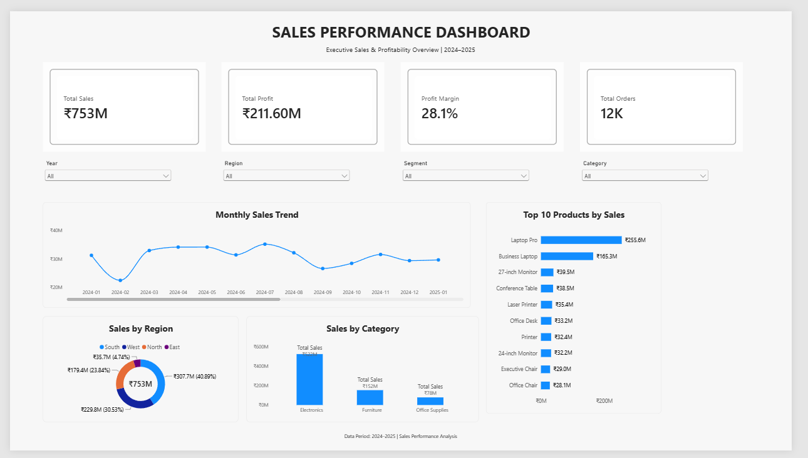

# 📊 Sales Performance Dashboard
A Power BI dashboard designed to analyze sales performance, profitability, regional performance, product performance, and category-level sales trends for 2024–2025.

**Tool:** Power BI Desktop | **Data:** 12,000 Sales Records | **Period:** 2024–2025

## 🎯 Business Objective

The objective of this project is to provide an interactive view of sales performance and profitability using Power BI.

The dashboard helps users:

- Monitor total sales and profit
- Evaluate overall profit margin
- Track order volume
- Analyze monthly sales trends
- Compare sales performance across regions
- Identify high-performing product categories
- Identify the top 10 products by sales
- Filter results by year, region, customer segment, and product category

## 🛠️ Tools & Technologies

- **Power BI Desktop** – Dashboard development and visualization
- **Power Query** – Data cleaning and transformation
- **DAX** – Calculated measures and business metrics
- **Power BI Data Model** – Relationships and data modeling
- **Git & GitHub** – Project version control and portfolio sharing

## 📁 Dataset

The project uses a sales dataset containing **12,000 sales records** covering the period **2024–2025**.

The Power BI model consists of the following tables:

- **Sales** – Transaction-level sales data
- **Products** – Product and category information
- **Customers** – Customer and segment information
- **Salespersons** – Salesperson information
- **Regions** – Regional information
- **Date** – Date dimension used for time-based analysis

The dataset was cleaned and transformed using **Power Query** before building the data model and dashboard.

## 🧹 Data Preparation

The dataset was prepared in Power Query before creating the dashboard.

Key preparation steps included:

- Removed unnecessary and duplicate records
- Checked and handled missing values
- Corrected data types
- Standardized date fields
- Validated numerical columns such as quantity, price, discount, and cost
- Created a dedicated Date table for time-based analysis
- Created relationships between the Sales table and supporting dimension tables
- Verified the final data model before creating DAX measures

## 🧩 Data Model

The Power BI model follows a simple **star-schema structure**, with the `Sales` table serving as the central fact table and the remaining tables acting as supporting dimensions.

### Tables

- `Sales`
- `Products`
- `Customers`
- `Salespersons`
- `Regions`
- `Date`

### Relationships

The following one-to-many relationships were created:

- `Date[Date]` → `Sales[Order_Date]`
- `Products[Product_ID]` → `Sales[Product_ID]`
- `Customers[Customer_ID]` → `Sales[Customer_ID]`
- `Salespersons[Salesperson_ID]` → `Sales[Salesperson_ID]`
- `Regions[Region_ID]` → `Sales[Region_ID]`

This model allows the dashboard visuals and slicers to interact dynamically across different dimensions.

## 📐 Key DAX Measures

The dashboard uses DAX measures to calculate the main business KPIs:

| Measure | Purpose |
|---|---|
| Total Sales | Calculates total sales after discounts |
| Total Cost | Calculates total product cost |
| Total Profit | Calculates sales minus total cost |
| Profit Margin | Calculates profit as a percentage of sales |
| Total Units | Calculates total quantity sold |
| Total Orders | Counts unique orders |
| Average Order Value | Calculates average revenue per order |
| Previous Year Sales | Calculates sales for the previous year |
| YoY Growth % | Measures year-over-year sales growth |
| YTD Sales | Calculates year-to-date sales |
| Previous Year Profit | Calculates previous-year profit |
| Profit Growth % | Measures year-over-year profit growth |

## 📊 Dashboard Features

The interactive dashboard includes:

### KPI Cards
- Total Sales
- Total Profit
- Profit Margin
- Total Orders

### Interactive Filters
- Year
- Region
- Customer Segment
- Product Category

### Visualizations
- Monthly Sales Trend
- Sales by Region
- Sales by Category
- Top 10 Products by Sales

All visuals respond dynamically to the selected filters, allowing users to explore sales performance from different perspectives.

## 🔍 Key Insights

The dashboard provides a high-level view of the company's sales performance and profitability.

Key areas of analysis include:

- Monitoring overall sales and profitability
- Comparing sales performance across regions
- Identifying the strongest product categories
- Identifying the top-performing products by sales
- Tracking monthly sales trends
- Evaluating profit margin alongside revenue
- Comparing current performance with the previous year
- Analyzing performance using interactive filters

## 🖥️ Dashboard Preview

## 💡 Business Recommendations

Based on the dashboard analysis, businesses can use these insights to:

- Focus on high-performing products and categories
- Investigate regions with comparatively lower sales performance
- Monitor monthly sales trends to identify seasonal patterns
- Track profit margin alongside sales to avoid focusing only on revenue
- Use customer segment performance to improve targeting
- Review year-over-year growth to evaluate business progress

## 🧠 Skills Demonstrated

- Data Cleaning & Transformation
- Data Modeling
- Star Schema Design
- DAX
- Time Intelligence
- KPI Development
- Interactive Dashboard Design
- Data Visualization
- Business Performance Analysis

## 🚀 Project Status

**Completed** ✅

The Power BI dashboard, data model, DAX measures, interactive filters, visualizations, and GitHub documentation have been completed.

